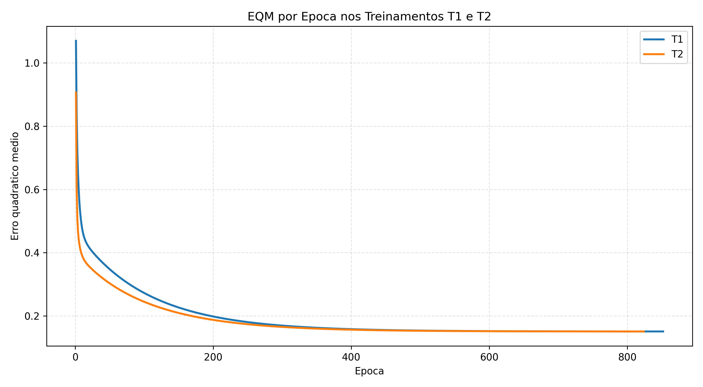
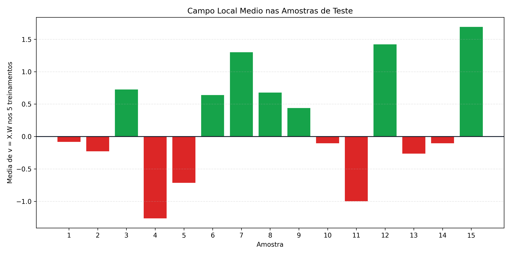

# Atividade - ADALINE

## Enunciado interpretado

A atividade pede o treinamento de uma rede ADALINE para classificar sinais ruidosos enviados a um comutador industrial. Pela convencao do enunciado:

- saida `-1`: sinal encaminhado para a valvula A;
- saida `+1`: sinal encaminhado para a valvula B.

Foram usados os dados de treinamento do anexo do arquivo `Adaline.docx`, com quatro grandezas de entrada `x1`, `x2`, `x3` e `x4`.

## Metodo usado

O ADALINE foi implementado em Python no arquivo [treinar_adaline.py](./treinar_adaline.py), sem uso de `scikit-learn` ou bibliotecas similares.

A entrada foi montada com bias:

```text
X = [-1, x1, x2, x3, x4]
W = [w0, w1, w2, w3, w4]
```

O campo local induzido e:

```text
y = X.W
```

Durante o treinamento, o ajuste dos pesos foi feito pela Regra Delta:

```text
erro = d - y
W(novo) = W(antigo) + eta.erro.X
```

Parametros usados:

- taxa de aprendizado: `eta = 0.0025`;
- precisao: `epsilon = 10^-6`;
- pesos iniciais aleatorios entre `0` e `1`;
- cinco treinamentos com sementes diferentes para evitar vetores iniciais iguais.

O criterio de parada compara a variacao do erro quadratico medio entre duas epocas consecutivas:

```text
|EQM_atual - EQM_anterior| <= epsilon
```

## Graficos

### EQM dos treinamentos T1 e T2



O grafico mostra a reducao do erro quadratico medio ao longo das epocas para os dois primeiros treinamentos, conforme pedido no enunciado.

### Campo local medio nas amostras de teste



Este grafico mostra o valor medio do campo local `v = X.W` nas amostras de teste considerando os cinco treinamentos. Barras positivas indicam decisao pela valvula B; barras negativas indicam decisao pela valvula A.

## Resultados dos cinco treinamentos

Tabela obtida ao executar os 5 treinamentos com pesos iniciais aleatorios entre `0` e `1`:

| Treinamento | w0 inicial | w1 inicial | w2 inicial | w3 inicial | w4 inicial | w0 final | w1 final | w2 final | w3 final | w4 final | Epocas |
| --- | ---: | ---: | ---: | ---: | ---: | ---: | ---: | ---: | ---: | ---: | ---: |
| T1 | 0.943533 | 0.359421 | 0.784805 | 0.591278 | 0.294329 | -1.799565 | 1.310659 | 1.635475 | -0.418042 | -1.172900 | 852 |
| T2 | 0.346287 | 0.443656 | 0.815755 | 0.687492 | 0.300426 | -1.799487 | 1.310645 | 1.635434 | -0.417988 | -1.172871 | 824 |
| T3 | 0.214432 | 0.416822 | 0.807695 | 0.273923 | 0.815780 | -1.799592 | 1.310533 | 1.635325 | -0.418322 | -1.172815 | 812 |
| T4 | 0.302904 | 0.452382 | 0.304360 | 0.556623 | 0.407828 | -1.799404 | 1.310558 | 1.635301 | -0.418075 | -1.172788 | 832 |
| T5 | 0.850423 | 0.703338 | 0.017425 | 0.999221 | 0.779294 | -1.799387 | 1.310645 | 1.635404 | -0.417887 | -1.172846 | 882 |

Para reproduzir a tabela e gerar novamente os graficos:

```bash
python treinar_adaline.py
```

Os valores finais tendem a ficar praticamente iguais porque o ADALINE minimiza uma superficie de erro quadratica. Essa superficie possui um minimo bem definido para o conjunto de treinamento. Assim, mesmo partindo de pesos iniciais diferentes, a Regra Delta converge para a mesma regiao de minimo; o que muda principalmente e o caminho percorrido e a quantidade de epocas necessaria para atingir a precisao definida.

## Classificacao

A classificacao de cada amostra de teste e feita aplicando a funcao sinal ao campo local:

```text
classe = +1, se y >= 0
classe = -1, se y < 0
```

Portanto:

- `-1` representa encaminhamento para a valvula A;
- `+1` representa encaminhamento para a valvula B.

| Amostra | x1 | x2 | x3 | x4 | y(T1) | y(T2) | y(T3) | y(T4) | y(T5) | Comando medio |
| ---: | ---: | ---: | ---: | ---: | ---: | ---: | ---: | ---: | ---: | --- |
| 1 | 0.9694 | 0.6909 | 0.4334 | 3.4965 | -1 | -1 | -1 | -1 | -1 | Valvula A |
| 2 | 0.5427 | 1.3832 | 0.6390 | 4.0352 | -1 | -1 | -1 | -1 | -1 | Valvula A |
| 3 | 0.6081 | -0.9196 | 0.5925 | 0.1016 | 1 | 1 | 1 | 1 | 1 | Valvula B |
| 4 | -0.1618 | 0.4694 | 0.2030 | 3.0117 | -1 | -1 | -1 | -1 | -1 | Valvula A |
| 5 | 0.1870 | -0.2578 | 0.6124 | 1.7749 | -1 | -1 | -1 | -1 | -1 | Valvula A |
| 6 | 0.4891 | -0.5276 | 0.4378 | 0.6439 | 1 | 1 | 1 | 1 | 1 | Valvula B |
| 7 | 0.3777 | 2.0149 | 0.7423 | 3.3932 | 1 | 1 | 1 | 1 | 1 | Valvula B |
| 8 | 1.1498 | -0.4067 | 0.2469 | 1.5866 | 1 | 1 | 1 | 1 | 1 | Valvula B |
| 9 | 0.9325 | 1.0950 | 1.0359 | 3.3591 | 1 | 1 | 1 | 1 | 1 | Valvula B |
| 10 | 0.5060 | 1.3317 | 0.9222 | 3.7174 | -1 | -1 | -1 | -1 | -1 | Valvula A |
| 11 | 0.0497 | -2.0656 | 0.6124 | -0.6585 | -1 | -1 | -1 | -1 | -1 | Valvula A |
| 12 | 0.4004 | 3.5369 | 0.9766 | 5.3532 | 1 | 1 | 1 | 1 | 1 | Valvula B |
| 13 | -0.1874 | 1.3343 | 0.5374 | 3.2189 | -1 | -1 | -1 | -1 | -1 | Valvula A |
| 14 | 0.5060 | 1.3317 | 0.9222 | 3.7174 | -1 | -1 | -1 | -1 | -1 | Valvula A |
| 15 | 1.6375 | -0.7911 | 0.7537 | 0.5515 | 1 | 1 | 1 | 1 | 1 | Valvula B |
