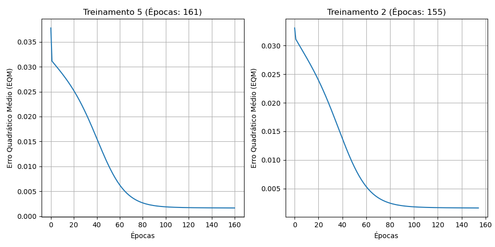

# Trabalho - Perceptron Multicamadas (Backpropagation)

1\. Execute 5 treinamentos...

2\. Registre os resultados finais desses 5 treinamentos na tabela
abaixo:

| Treinamento | Erro Quadrático Médio | Número de Épocas |
|-------------|-----------------------|------------------|
| 1º (T1)     | 0.001592              | 143              |
| 2º (T2)     | 0.001612              | 155              |
| 3º (T3)     | 0.001555              | 128              |
| 4º (T4)     | 0.001583              | 154              |
| 5º (T5)     | 0.001645              | 161              |

3\. Para os dois treinamentos acima com maiores números de épocas, trace
os respectivos gráficos...

Os gráficos do Erro Quadrático Médio em função das épocas estão na
imagem abaixo (grafico_eqm.png):

4\. Baseado na tabela do item 2, explique de forma detalhada por que
tanto o erro quadrático médio quanto o número de épocas variam de
treinamento para treinamento.

A variação no Erro Quadrático Médio (EQM) final e no número de épocas
entre diferentes treinamentos se deve principalmente à inicialização
aleatória dos pesos sinápticos e dos vieses (bias) no início de cada
treinamento. A superfície de erro da rede neural (que é percorrida pelo
algoritmo de otimização de gradiente descendente) é altamente não linear
e pode conter vários mínimos locais, vales e regiões planas (platôs).
Dependendo do ponto de partida (determinado pelos pesos iniciais
aleatórios), o algoritmo backpropagation pode seguir diferentes caminhos
de descida. Isso faz com que a rede demore mais ou menos épocas para
alcançar o critério de parada (precisão de 10-6). Além disso,
a convergência pode ocorrer em mínimos locais diferentes que possuem
valores de EQM final distintos.

5\. Para todos os treinamentos efetuados no item 2, faça a validação da
rede aplicando o conjunto de teste...

| Amostra                     | x1     | x2     | x3     | d      | y_rede (T1) | y_rede (T2) | y_rede (T3) | y_rede (T4) | y_rede (T5) |
|-----------------------------|--------|--------|--------|--------|-------------|-------------|-------------|-------------|-------------|
| 1                           | 0.0611 | 0.2860 | 0.7464 | 0.4831 | 0.4914      | 0.4930      | 0.4958      | 0.4971      | 0.4935      |
| 2                           | 0.5102 | 0.7464 | 0.0860 | 0.5965 | 0.6016      | 0.6018      | 0.6030      | 0.6033      | 0.6034      |
| 3                           | 0.0004 | 0.6916 | 0.5006 | 0.5318 | 0.5343      | 0.5361      | 0.5379      | 0.5383      | 0.5371      |
| 4                           | 0.9430 | 0.4476 | 0.2648 | 0.6843 | 0.7174      | 0.7167      | 0.7177      | 0.7169      | 0.7160      |
| 5                           | 0.1399 | 0.1610 | 0.2477 | 0.2872 | 0.2840      | 0.2854      | 0.2829      | 0.2820      | 0.2808      |
| 6                           | 0.6423 | 0.3229 | 0.8567 | 0.7663 | 0.7624      | 0.7647      | 0.7614      | 0.7618      | 0.7641      |
| 7                           | 0.6492 | 0.0007 | 0.6422 | 0.5666 | 0.5795      | 0.5802      | 0.5794      | 0.5829      | 0.5824      |
| 8                           | 0.1818 | 0.5078 | 0.9046 | 0.6601 | 0.6903      | 0.6932      | 0.6915      | 0.6915      | 0.6922      |
| 9                           | 0.7382 | 0.2647 | 0.1916 | 0.5427 | 0.5423      | 0.5414      | 0.5435      | 0.5439      | 0.5426      |
| 10                          | 0.3879 | 0.1307 | 0.8656 | 0.5836 | 0.6133      | 0.6162      | 0.6144      | 0.6175      | 0.6173      |
| 11                          | 0.1903 | 0.6523 | 0.7820 | 0.6950 | 0.7016      | 0.7035      | 0.7022      | 0.7020      | 0.7031      |
| 12                          | 0.8401 | 0.4490 | 0.2719 | 0.6790 | 0.6855      | 0.6851      | 0.6862      | 0.6859      | 0.6850      |
| 13                          | 0.0029 | 0.3264 | 0.2476 | 0.2956 | 0.2924      | 0.2951      | 0.2923      | 0.2915      | 0.2891      |
| 14                          | 0.7088 | 0.9342 | 0.2763 | 0.7742 | 0.7897      | 0.7882      | 0.7877      | 0.7880      | 0.7888      |
| 15                          | 0.1283 | 0.1882 | 0.7253 | 0.4662 | 0.4702      | 0.4711      | 0.4741      | 0.4758      | 0.4720      |
| 16                          | 0.8882 | 0.3077 | 0.8931 | 0.8093 | 0.8249      | 0.8256      | 0.8228      | 0.8220      | 0.8253      |
| 17                          | 0.2225 | 0.9182 | 0.7820 | 0.7581 | 0.7885      | 0.7874      | 0.7856      | 0.7847      | 0.7868      |
| 18                          | 0.1957 | 0.8423 | 0.3085 | 0.5826 | 0.6002      | 0.6009      | 0.6013      | 0.6021      | 0.6033      |
| 19                          | 0.9991 | 0.5914 | 0.3933 | 0.7938 | 0.8055      | 0.8051      | 0.8048      | 0.8038      | 0.8037      |
| 20                          | 0.2299 | 0.1524 | 0.7353 | 0.5012 | 0.5030      | 0.5042      | 0.5062      | 0.5085      | 0.5055      |
| **Erro Relativo Médio (%)** |        |        |        |        | **1.9065%** | **1.9403%** | **2.0946%** | **2.2256%** | **2.1846%** |
| **Variância (%)**           |        |        |        |        | **2.3468%** | **2.6725%** | **2.1160%** | **2.2218%** | **2.4007%** |

6\. Baseado nas análises da tabela acima indique qual das configurações
finais de treinamento seria a mais adequada para o sistema...

Baseado na tabela de testes, a configuração **T1** seria a mais adequada
para o sistema de ressonância magnética. Essa configuração apresenta o
menor Erro Relativo Médio e uma baixa variância ao ser aplicada ao
conjunto de testes (dados inéditos que não fizeram parte do
treinamento). Isso demonstra que essa configuração conseguiu a melhor
generalização da função mapeada, ao invés de apenas decorar os padrões
de treinamento.

