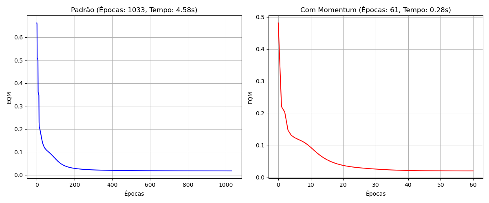

# Trabalho - Perceptron Multicamadas (Backpropagation) - PMC2

1\. e 2. Execute os treinamentos (Padrão e com Momentum) e trace os
gráficos

Abaixo seguem os resultados das duas execuções solicitadas (padrão e com
momentum):

- **Backpropagation Padrão (η=0.1, sem momentum):** 1033 épocas, Tempo:
  4.58 segundos.
- **Backpropagation com Momentum (η=0.1, α=0.9):** 61 épocas, Tempo:
  0.28 segundos.

Os gráficos do Erro Quadrático Médio em função das épocas para ambos os
treinamentos estão na imagem abaixo (grafico_eqm.png):

3\. e 4. Faça a validação da rede aplicando o conjunto de teste
fornecido... Forneça a taxa de acerto (%).

A tabela a seguir mostra os resultados da rede treinada com
**Backpropagation Padrão** (já que o objetivo principal é classificação,
e ambos os treinamentos usam os mesmos dados, utilizaremos o modelo
padrão aqui como exemplo representativo para a tabela. A taxa de acerto
do modelo com momentum também foi calculada e é de 100.00%).

| Amostra                 | x1     | x2     | x3     | x4     | d1  | d2  | d3  | y1     | y2     | y3     | y1 (arred.) | y2 (arred.) | y3 (arred.) |
|-------------------------|--------|--------|--------|--------|-----|-----|-----|--------|--------|--------|-------------|-------------|-------------|
| 1                       | 0.8622 | 0.7101 | 0.6236 | 0.7894 | 0   | 0   | 1   | 0.0000 | 0.0059 | 0.9950 | **0**       | **0**       | **1**       |
| 2                       | 0.2741 | 0.1552 | 0.1333 | 0.1516 | 1   | 0   | 0   | 0.9985 | 0.0056 | 0.0000 | **1**       | **0**       | **0**       |
| 3                       | 0.6772 | 0.8516 | 0.6543 | 0.7573 | 0   | 0   | 1   | 0.0000 | 0.0055 | 0.9957 | **0**       | **0**       | **1**       |
| 4                       | 0.2178 | 0.5039 | 0.6415 | 0.5039 | 0   | 1   | 0   | 0.0043 | 0.9822 | 0.0016 | **0**       | **1**       | **0**       |
| 5                       | 0.7260 | 0.7500 | 0.7007 | 0.4953 | 0   | 0   | 1   | 0.0000 | 0.0887 | 0.9239 | **0**       | **0**       | **1**       |
| 6                       | 0.2473 | 0.2941 | 0.4248 | 0.3087 | 1   | 0   | 0   | 0.9427 | 0.0587 | 0.0000 | **1**       | **0**       | **0**       |
| 7                       | 0.5682 | 0.5683 | 0.5054 | 0.4426 | 0   | 1   | 0   | 0.0016 | 0.9834 | 0.0040 | **0**       | **1**       | **0**       |
| 8                       | 0.6566 | 0.6715 | 0.4952 | 0.3951 | 0   | 1   | 0   | 0.0006 | 0.9747 | 0.0134 | **0**       | **1**       | **0**       |
| 9                       | 0.0705 | 0.4717 | 0.2921 | 0.2954 | 1   | 0   | 0   | 0.9725 | 0.0320 | 0.0000 | **1**       | **0**       | **0**       |
| 10                      | 0.1187 | 0.2568 | 0.3140 | 0.3037 | 1   | 0   | 0   | 0.9927 | 0.0118 | 0.0000 | **1**       | **0**       | **0**       |
| 11                      | 0.5673 | 0.7011 | 0.4083 | 0.5552 | 0   | 1   | 0   | 0.0005 | 0.9713 | 0.0144 | **0**       | **1**       | **0**       |
| 12                      | 0.3164 | 0.2251 | 0.3526 | 0.2560 | 1   | 0   | 0   | 0.9860 | 0.0182 | 0.0000 | **1**       | **0**       | **0**       |
| 13                      | 0.7884 | 0.9568 | 0.6825 | 0.6398 | 0   | 0   | 1   | 0.0000 | 0.0027 | 0.9982 | **0**       | **0**       | **1**       |
| 14                      | 0.9633 | 0.7850 | 0.6777 | 0.6059 | 0   | 0   | 1   | 0.0000 | 0.0046 | 0.9966 | **0**       | **0**       | **1**       |
| 15                      | 0.7739 | 0.8505 | 0.7934 | 0.6626 | 0   | 0   | 1   | 0.0000 | 0.0021 | 0.9988 | **0**       | **0**       | **1**       |
| 16                      | 0.4219 | 0.4136 | 0.1408 | 0.0940 | 1   | 0   | 0   | 0.9927 | 0.0120 | 0.0000 | **1**       | **0**       | **0**       |
| 17                      | 0.6616 | 0.4365 | 0.6597 | 0.8129 | 0   | 0   | 1   | 0.0000 | 0.2391 | 0.7352 | **0**       | **0**       | **1**       |
| 18                      | 0.7325 | 0.4761 | 0.3888 | 0.5683 | 0   | 1   | 0   | 0.0018 | 0.9794 | 0.0036 | **0**       | **1**       | **0**       |
| **Taxa de Acerto (%):** |        |        |        |        |     |     |     |        |        |        | **100.00%** |             |             |
