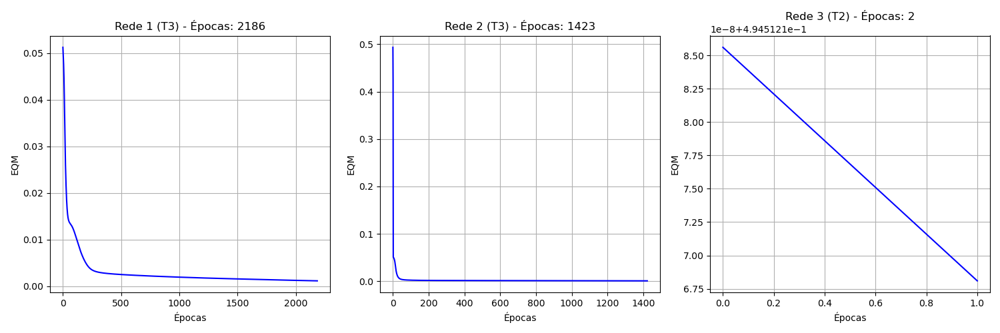
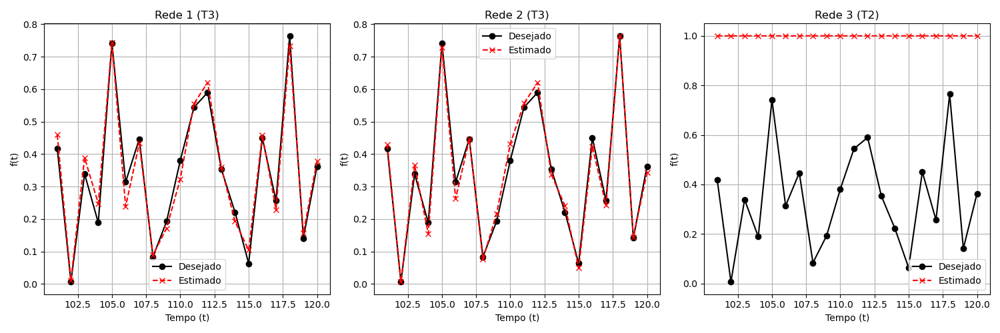

# Trabalho - Perceptron Multicamadas (Backpropagation) - PMC3

2\. Registre os resultados finais desses 3 treinamentos para cada uma
das três topologias de rede na tabela a seguir:

| Treinamento | Rede 1   |        | Rede 2   |        | Rede 3   |        |
|-------------|----------|--------|----------|--------|----------|--------|
|             | EQM      | Épocas | EQM      | Épocas | EQM      | Épocas |
| 1º (T1)     | 0.000927 | 2493   | 0.000543 | 1494   | 0.494518 | 2      |
| 2º (T2)     | 0.001550 | 1535   | 0.000873 | 1153   | 0.494512 | 2      |
| 3º (T3)     | 0.001139 | 2186   | 0.000741 | 1423   | 0.494514 | 2      |

3\. Faça a validação da rede em relação aos valores desejados
apresentados na tabela abaixo.

|                          |        | Rede 1      |              |             | Rede 2     |            |            | Rede 3           |                  |                  |
|--------------------------|--------|-------------|--------------|-------------|------------|------------|------------|------------------|------------------|------------------|
| Amostra                  | f(t)   | (T1)        | (T2)         | (T3)        | (T1)       | (T2)       | (T3)       | (T1)             | (T2)             | (T3)             |
| t = 101                  | 0.4173 | 0.4634      | 0.4617       | 0.4593      | 0.4233     | 0.4228     | 0.4290     | 1.0000           | 1.0000           | 1.0000           |
| t = 102                  | 0.0062 | 0.0141      | 0.0191       | 0.0105      | 0.0041     | 0.0064     | 0.0062     | 1.0000           | 1.0000           | 1.0000           |
| t = 103                  | 0.3387 | 0.3803      | 0.3759       | 0.3887      | 0.3575     | 0.3834     | 0.3658     | 1.0000           | 1.0000           | 1.0000           |
| t = 104                  | 0.1886 | 0.2384      | 0.2611       | 0.2477      | 0.1525     | 0.1491     | 0.1548     | 1.0000           | 1.0000           | 1.0000           |
| t = 105                  | 0.7418 | 0.7359      | 0.7067       | 0.7426      | 0.7237     | 0.7381     | 0.7299     | 1.0000           | 1.0000           | 1.0000           |
| t = 106                  | 0.3138 | 0.2489      | 0.2120       | 0.2384      | 0.2883     | 0.2586     | 0.2626     | 1.0000           | 1.0000           | 1.0000           |
| t = 107                  | 0.4466 | 0.4260      | 0.4144       | 0.4327      | 0.4362     | 0.4423     | 0.4448     | 1.0000           | 1.0000           | 1.0000           |
| t = 108                  | 0.0835 | 0.0759      | 0.0780       | 0.0891      | 0.0879     | 0.0795     | 0.0762     | 1.0000           | 1.0000           | 1.0000           |
| t = 109                  | 0.1930 | 0.1847      | 0.2142       | 0.1716      | 0.2239     | 0.2228     | 0.2168     | 1.0000           | 1.0000           | 1.0000           |
| t = 110                  | 0.3807 | 0.3323      | 0.3072       | 0.3236      | 0.4328     | 0.4688     | 0.4318     | 1.0000           | 1.0000           | 1.0000           |
| t = 111                  | 0.5438 | 0.5602      | 0.5599       | 0.5554      | 0.5540     | 0.5499     | 0.5561     | 1.0000           | 1.0000           | 1.0000           |
| t = 112                  | 0.5897 | 0.6159      | 0.6204       | 0.6206      | 0.5900     | 0.6144     | 0.6200     | 1.0000           | 1.0000           | 1.0000           |
| t = 113                  | 0.3536 | 0.3563      | 0.3752       | 0.3597      | 0.3484     | 0.3425     | 0.3372     | 1.0000           | 1.0000           | 1.0000           |
| t = 114                  | 0.2210 | 0.2052      | 0.2103       | 0.1927      | 0.2197     | 0.2408     | 0.2409     | 1.0000           | 1.0000           | 1.0000           |
| t = 115                  | 0.0631 | 0.0924      | 0.1137       | 0.1042      | 0.0456     | 0.0430     | 0.0490     | 1.0000           | 1.0000           | 1.0000           |
| t = 116                  | 0.4499 | 0.4667      | 0.4436       | 0.4580      | 0.4349     | 0.4159     | 0.4235     | 1.0000           | 1.0000           | 1.0000           |
| t = 117                  | 0.2564 | 0.2248      | 0.2337       | 0.2293      | 0.2355     | 0.2449     | 0.2417     | 1.0000           | 1.0000           | 1.0000           |
| t = 118                  | 0.7642 | 0.7323      | 0.7680       | 0.7321      | 0.7729     | 0.7569     | 0.7630     | 1.0000           | 1.0000           | 1.0000           |
| t = 119                  | 0.1411 | 0.1554      | 0.1454       | 0.1563      | 0.1397     | 0.1527     | 0.1434     | 1.0000           | 1.0000           | 1.0000           |
| t = 120                  | 0.3626 | 0.3748      | 0.3284       | 0.3780      | 0.3559     | 0.3512     | 0.3428     | 1.0000           | 1.0000           | 1.0000           |
| **Erro Relativo Médio:** |        | **16.28%**  | **23.61%**   | **15.22%**  | **7.74%**  | **8.76%**  | **7.22%**  | **1112.56%**     | **1112.55%**     | **1112.55%**     |
| **Variância:**           |        | **766.71%** | **2116.54%** | **359.05%** | **87.05%** | **73.83%** | **38.07%** | **11838140.99%** | **11838043.49%** | **11838078.89%** |

4\. Trace o gráfico dos valores de erro quadrático médio (EQM) em função
de cada época de treinamento para o melhor de cada rede.

Abaixo estão os gráficos do EQM para a melhor execução (menor Erro
Relativo no Teste) de cada uma das três topologias:

5\. Trace o gráfico dos valores desejados e dos valores estimados pela
respectiva rede em função do domínio de estimação.

Abaixo estão os gráficos comparando o valor desejado f(t) e o valor
estimado y(t) para o conjunto de testes (t=101..120) para o melhor
treinamento de cada topologia:

6\. Indique qual das topologias candidatas e configuração final seria a
mais adequada para previsão.

Baseado nas análises das tabelas e gráficos, a topologia mais adequada é
a **Rede 2** utilizando a configuração de treinamento **T3**. Esta
combinação apresentou o menor Erro Relativo Médio (7.22%) sobre o
conjunto de dados de teste (dados não vistos durante o treinamento),
demonstrando a melhor capacidade de generalização e aderência aos dados
temporais futuros (t=101 a 120).

7\. Investigue e comente sobre as principais características e vantagens
dos seguintes algoritmos de treinamento:

**a. Algoritmo de treinamento Resilient-Propagation (RProp)**  
O RProp (Resilient Backpropagation) é um algoritmo de aprendizado
heurístico cuja principal característica é utilizar apenas o **sinal**
(direção) do gradiente de erro para atualizar os pesos, ignorando a
magnitude (valor absoluto) do gradiente. Para cada peso, ele mantém um
fator de atualização individual. Se o gradiente mantiver o mesmo sinal
por duas épocas seguidas, o tamanho do passo aumenta (aceleração); se o
sinal inverter (indicando que o mínimo foi ultrapassado), o tamanho do
passo diminui.  
*Vantagens:* É extremamente rápido e robusto. Resolve problemas
clássicos do gradiente descendente convencional, como a estagnação em
regiões de platô (onde o gradiente é muito pequeno), permitindo uma
convergência muito mais rápida. Não requer ajuste manual criterioso da
taxa de aprendizagem para cada problema.  
  
**b. Algoritmo de treinamento Levenberg-Marquardt (LM)**  
O algoritmo de Levenberg-Marquardt é uma técnica de otimização numérica
que combina a velocidade do método de Newton (ou Gauss-Newton) com a
estabilidade do método do Gradiente Descendente. Ele utiliza a matriz
Jacobiana (derivadas dos erros em relação aos pesos) para aproximar a
matriz Hessiana. Quando o algoritmo está longe do mínimo, ele se
comporta como o gradiente descendente (passos pequenos e seguros);
quando se aproxima do mínimo, ele transiciona para o método de
Gauss-Newton, garantindo uma convergência quadrática e extremamente
rápida.  
*Vantagens:* É considerado um dos algoritmos de treinamento mais rápidos
disponíveis para redes neurais de tamanho moderado. Apresenta excelente
taxa de convergência e costuma encontrar erros muito menores que o
backpropagation padrão em consideravelmente menos épocas. A principal
desvantagem é o alto custo computacional por época e o grande consumo de
memória, pois exige o cálculo e armazenamento da matriz Jacobiana,
tornando-o inadequado para redes gigantescas.

