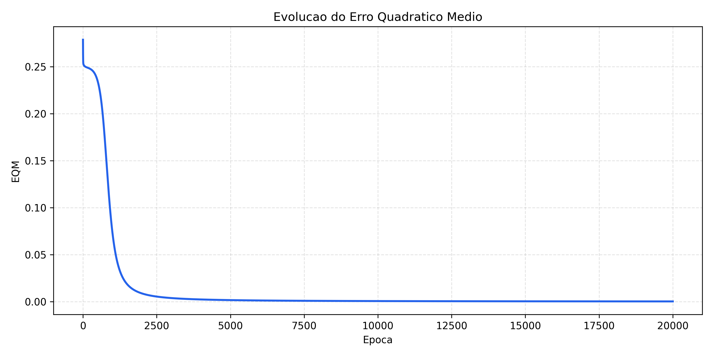
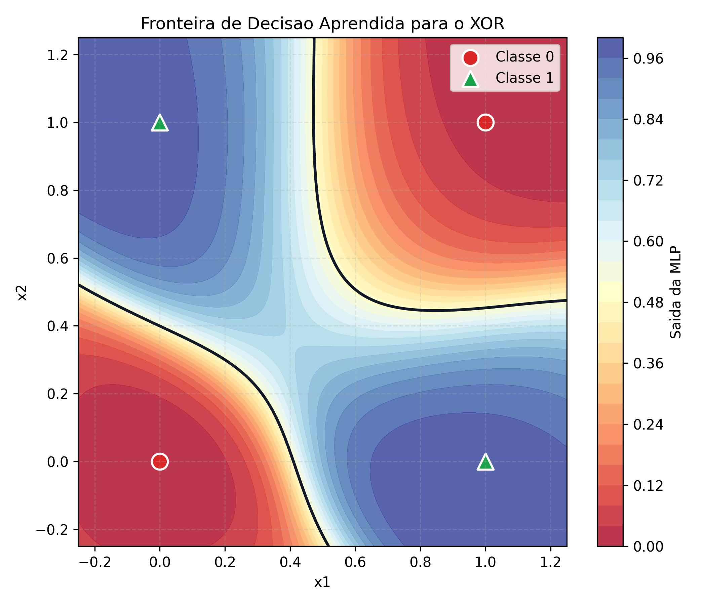
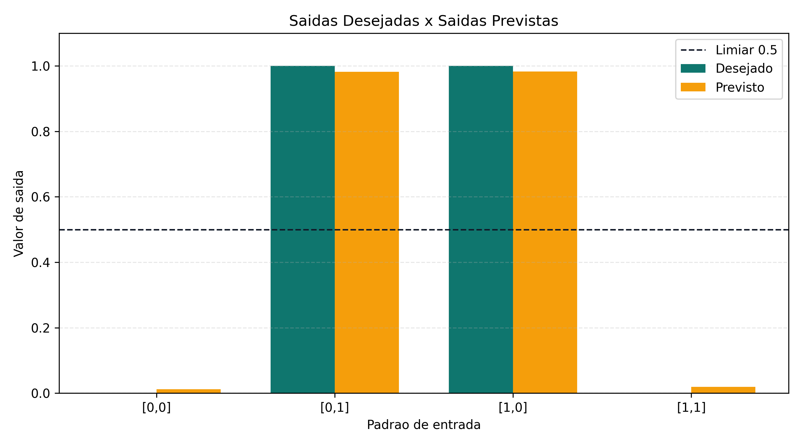

# Atividade - Perceptron Multicamadas

## Enunciado interpretado

O PDF solicita demonstrar, de forma detalhada, a sequencia de calculo e de ajuste das matrizes de pesos de uma rede neural artificial do tipo perceptron multicamadas com tres camadas:

- camada de entrada com `N` sinais: `X1, X2, ..., XN`;
- camada neural escondida com `N1` neuronios;
- camada neural de saida com 1 neuronio;
- conjunto de treinamento com `P` padroes.

A convencao pedida e:

- `W1`: matriz de pesos entre a 1a e a 2a camada;
- `W2`: matriz de pesos entre a 2a e a 3a camada;
- `W3`: matriz de pesos entre a 1a e a 3a camada.

## Dimensoes das matrizes

Considerando os padroes de treinamento em uma matriz `X`:

- `X`: matriz de entrada, dimensao `P x N`;
- `D`: saidas desejadas, dimensao `P x 1`;
- `W1`: pesos entrada-escondida, dimensao `N x N1`;
- `W2`: pesos escondida-saida, dimensao `N1 x 1`;
- `W3`: pesos entrada-saida, dimensao `N x 1`;
- `b1`: bias da camada escondida, dimensao `1 x N1`;
- `b2`: bias da camada de saida, dimensao `1 x 1`.

## Propagacao direta

Para cada padrao, ou para todos os `P` padroes em forma matricial:

```text
I1 = X.W1 + b1
Z  = f(I1)
I2 = Z.W2 + X.W3 + b2
Y  = f(I2)
E  = D - Y
```

Onde:

- `I1` e o campo local induzido na camada escondida;
- `Z` e a saida da camada escondida;
- `I2` e o campo local induzido no neuronio de saida;
- `Y` e a saida produzida pela rede;
- `E` e o erro entre a saida desejada e a saida produzida;
- `f` e a funcao de ativacao sigmoide.

A funcao sigmoide utilizada no codigo foi:

```text
f(u) = 1 / (1 + e^(-u))
f'(u) = f(u).(1 - f(u))
```

## Retropropagacao do erro

Primeiro calcula-se o gradiente local do neuronio de saida:

```text
delta_saida = (D - Y) * Y * (1 - Y)
```

Depois calcula-se o gradiente local da camada escondida. Como a camada escondida influencia a saida por meio de `W2`, o erro da saida e retropropagado por essa matriz:

```text
delta_escondida = (delta_saida.W2^T) * Z * (1 - Z)
```

## Ajuste das matrizes de pesos

Com taxa de aprendizagem `eta`, os ajustes ficam:

```text
W2(novo) = W2(antigo) + eta * Z^T.delta_saida
W3(novo) = W3(antigo) + eta * X^T.delta_saida
W1(novo) = W1(antigo) + eta * X^T.delta_escondida
```

Para os biases:

```text
b2(novo) = b2(antigo) + eta * delta_saida
b1(novo) = b1(antigo) + eta * delta_escondida
```

Quando o treinamento e feito por lote, como no codigo, os incrementos sao divididos pela quantidade de padroes `P`, usando a media dos gradientes.

## Criterio de parada

O treinamento pode ser encerrado quando uma das condicoes ocorrer:

- o erro quadratico medio ficar menor ou igual a uma tolerancia pre-definida;
- a quantidade maxima de epocas for atingida.

O erro quadratico medio usado foi:

```text
EQM = media((D - Y)^2)
```

## Codigo desenvolvido

O arquivo [mlp_backpropagation.py](./mlp_backpropagation.py) implementa a rede sem `scikit-learn` ou bibliotecas semelhantes. A unica biblioteca externa usada e `numpy`, apenas para operacoes matriciais.

Para executar:

```bash
python mlp_backpropagation.py
```

O exemplo incluido treina a rede no problema XOR, que e um caso classico que nao pode ser resolvido por um perceptron de camada unica, mas pode ser aprendido por uma MLP com camada escondida.

## Graficos gerados

O script tambem gera tres imagens em PNG para evidenciar o comportamento da rede durante e apos o treinamento.

### Curva de erro



Este grafico mostra a reducao do erro quadratico medio ao longo das epocas. A queda do erro evidencia que o algoritmo de Backpropagation esta ajustando as matrizes `W1`, `W2` e `W3` na direcao correta.

### Fronteira de decisao



Este grafico mostra a superficie de decisao aprendida pela MLP para o problema XOR. A linha escura representa o limiar de classificacao `0.5`. Como o XOR nao e linearmente separavel, a fronteira curva evidencia a importancia da camada escondida.

### Saidas previstas



Este grafico compara, para cada padrao, a saida desejada com a saida prevista pela rede apos o treinamento.

## Resultado esperado do exemplo

Ao final do treinamento, as saidas devem ficar proximas de:

| Entrada | Desejado | Classe prevista |
| --- | ---: | ---: |
| `[0, 0]` | 0 | 0 |
| `[0, 1]` | 1 | 1 |
| `[1, 0]` | 1 | 1 |
| `[1, 1]` | 0 | 0 |

Assim, o codigo demonstra na pratica a propagacao direta, o calculo do erro, a retropropagacao e a atualizacao das matrizes `W1`, `W2` e `W3` pedidas na atividade.
