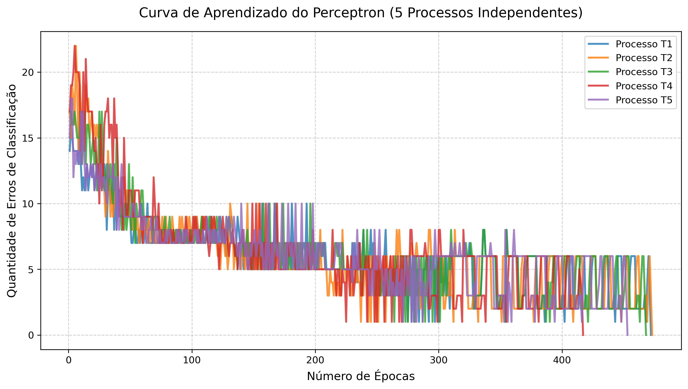
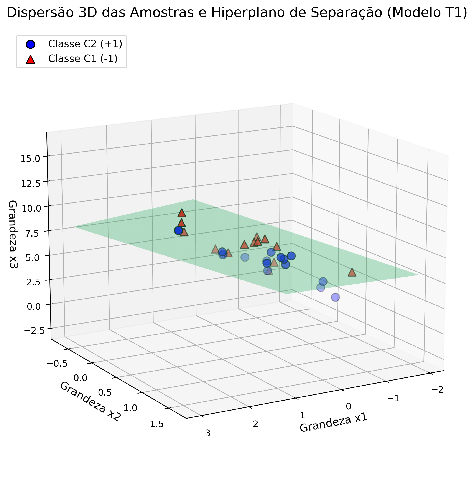

# Respostas Atividade I - Perceptron

## Treinamento e Gráficos

A rede perceptron foi construída em Python e treinada em 5 processos diferentes aplicando a Regra de Hebb supervisionada (taxa de aprendizagem = 0.01 e Bias = -1).

Abaixo estão os gráficos mostrando a estabilização da rede e a separação dos dados (o Hiperplano):

## Curva de Aprendizado (Erros por Época)

## Dispersão 3D e Hiperplano Separador

---

## Item 2: Resultados dos 5 Treinamentos

Abaixo estão registrados os resultados de convergência (quantidade de épocas e pesos sinápticos) obtidos em cada um dos treinamentos realizados com pesos iniciais randômicos entre 0 e 1:

| Treinamento | Épocas | $w_0$ Inicial | $w_1$ Inicial | $w_2$ Inicial | $w_3$ Inicial | $w_0$ Final | $w_1$ Final | $w_2$ Final | $w_3$ Final |
| :---: | :---: | :---: | :---: | :---: | :---: | :---: | :---: | :---: | :---: |
| **1º (T1)** | 472 | 0.7123 | 0.5009 | 0.7362 | 0.2186 | -1.5577 | 0.7830 | 1.2557 | -0.3702 |
| **2º (T2)** | 473 | 0.4863 | 0.0930 | 0.1191 | 0.0293 | -1.5837 | 0.7874 | 1.2648 | -0.3748 |
| **3º (T3)** | 468 | 0.8619 | 0.6469 | 0.3572 | 0.9158 | -1.5481 | 0.7724 | 1.2462 | -0.3679 |
| **4º (T4)** | 417 | 0.4697 | 0.0677 | 0.0108 | 0.9392 | -1.5203 | 0.7403 | 1.2368 | -0.3632 |
| **5º (T5)** | 453 | 0.8426 | 0.4277 | 0.6135 | 0.1890 | -1.5274 | 0.7599 | 1.2269 | -0.3630 |

---

## Item 3: Classificação Automática das Amostras

Tabela gerada a partir da classificação das amostras de teste utilizando os pesos obtidos nos 5 processos de treinamento (T1 a T5):

| Amostra | $x_1$ | $x_2$ | $x_3$ | $y(T1)$ | $y(T2)$ | $y(T3)$ | $y(T4)$ | $y(T5)$ |
| :---: | :---: | :---: | :---: | :---: | :---: | :---: | :---: | :---: |
| **01** | -0.3565 | 0.0620 | 5.9891 | -1 | -1 | -1 | -1 | -1 |
| **02** | -0.7842 | 1.1267 | 5.5912 | 1 | 1 | 1 | 1 | 1 |
| **03** | 0.3012 | 0.5611 | 5.8234 | 1 | 1 | 1 | 1 | 1 |
| **04** | 0.7757 | 1.0648 | 8.0677 | 1 | 1 | 1 | 1 | 1 |
| **05** | 0.1570 | 0.8028 | 6.3040 | 1 | 1 | 1 | 1 | 1 |
| **06** | -0.7014 | 1.0316 | 3.6005 | 1 | 1 | 1 | 1 | 1 |
| **07** | 0.3748 | 0.1536 | 6.1537 | -1 | -1 | -1 | -1 | -1 |
| **08** | -0.6920 | 0.9404 | 4.4058 | 1 | 1 | 1 | 1 | 1 |
| **09** | -1.3970 | 0.7141 | 4.9263 | -1 | -1 | -1 | -1 | -1 |
| **10** | -1.8842 | -0.2805 | 1.2548 | -1 | -1 | -1 | -1 | -1 |

---

## Questões Teóricas

**1. Explique por que o número de épocas de treinamento varia a cada vez que executamos o treinamento do perceptron.**

O número de épocas varia porque os pesos sinápticos e o *bias* (limiar) são inicializados com valores aleatórios a cada nova execução do algoritmo. O perceptron tenta ajustar iterativamente um "hiperplano" no espaço a fim de separar os dados corretamente. Partir de um "ponto inicial" diferente (pesos iniciais aleatórios diferentes) significa que o algoritmo precisará percorrer um caminho matemático diferente, exigindo uma quantidade maior ou menor de ajustes (épocas) até que o hiperplano convirja para o erro zero.

**2. Qual a principal limitação do perceptron quando aplicado em problemas de classificação de padrões.**

A principal limitação do perceptron de camada única (*Single-Layer Perceptron*) é que ele só é capaz de classificar e convergir em problemas onde os dados são estritamente linearmente separáveis. Se as classes estiverem distribuídas de uma forma complexa, em que não é possível desenhar um único hiperplano plano para dividi-las (como no famoso e clássico problema da porta lógica XOR - Ou Exclusivo), o algoritmo nunca convergirá. Nesses casos, ele tentará ajustar os pesos infinitamente, sendo necessário partir para redes mais complexas, como os Perceptrons de Múltiplas Camadas (MLP).